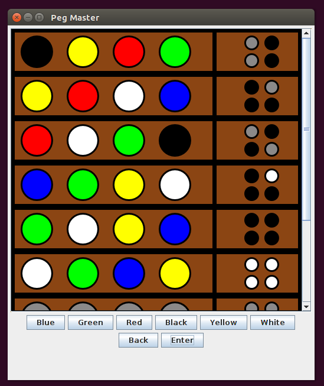

# PegMaster
Mastermind clone made in 10th grade

The code is randomly generated, enter a code using the buttons. Back deletes, enter submits to be checked.
Black result peg means right color, wrong position.
White result peg means right color, right position.
The result pegs are scrambled and do not correspond to an input slot.

